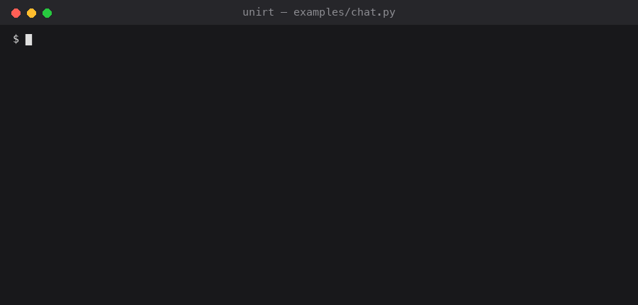

# UniRT

On-device inference runtime for **multiple hardware backends**. The stable C API covers LLM, VLM, and embedding handles; llama.cpp supports text, libmtmd image/audio inputs, and GGUF sentence embeddings; MLX implements text generation; ONNX Runtime runs encoder embeddings.



## Architecture

```
┌──────────────────────────────────────────────────────┐
│  Interfaces: Python │ OpenAI server │ CLI             │
│  └─ HF model store (huggingface_hub)                  │
├──────────────────────────────────────────────────────┤
│  UniRT SDK core (C++, stable C ABI: unirt.h)        │
│  └─ Registry — runtime plugin discovery & loading     │
├──────────────────────────────────────────────────────┤
│  Plugins (ILlm / IVlm / IEmbedding)               │
│  ├─ llama_cpp → GGUF on CPU / Metal / Vulkan / CUDA   │
│  ├─ mlx → HF safetensors on Apple Silicon GPU (MLX)   │
│  ├─ onnxruntime → ONNX embeddings on CPU / Core ML    │
│  └─ <your backend here> — versioned plugin ABI         │
└──────────────────────────────────────────────────────┘
```

Design principles:

- **Pure C inference API as the public ABI boundary** ([sdk/include/unirt.h](sdk/include/unirt.h)) — language bindings share the same runtime operations while network access remains outside the native library.
- **Version-gated plugin contract** ([sdk/include/plugin/](sdk/include/plugin/)) — a backend exports `plugin_id()`, `plugin_abi_version()`, and `create_plugin()`. The loader checks the ABI version before accepting the C++ interface object.
- **Python-native model management** ([bindings/python/unirt/model_manager.py](bindings/python/unirt/model_manager.py)) — `huggingface_hub` provides authenticated, resumable snapshot downloads; UniRT selects GGUF quantizations and maintains the small local manifest.

## Layout

| Path | Contents |
|---|---|
| `sdk/include/` | Public C API (`unirt.h`) and plugin interfaces |
| `sdk/src/` | Core: registry, LLM/VLM/embedding dispatch, device handling |
| `sdk/plugins/llama_cpp/` | llama.cpp + libmtmd backend (GGUF text models and GGUF/mmproj VLMs) |
| `sdk/plugins/mlx/` | MLX backend: tied-embedding Llama safetensors with a validated ByteLevel-BPE layout (currently SmolLM2-style), on Apple Silicon Metal |
| `sdk/plugins/onnxruntime/` | ONNX Runtime encoder backend: generic token tensors, pooling, normalization, CPU and optional Core ML |
| `bindings/python/` | Python package, Hugging Face model store, CLI, and ctypes runtime binding |
| `sdk/benchmark/` | TTFT / tokens-per-second benchmark harness |
| `third-party/llama.cpp` | Upstream llama.cpp (submodule) |

## Getting started (fresh clone, macOS)

```sh
# 0. prerequisites — each is a one-time setup
xcode-select --install                            # C++ toolchain
xcodebuild -downloadComponent MetalToolchain      # Metal shader compiler (Xcode 26+)
brew install cmake                                # CMake >= 3.16

# 1. clone with submodules (llama.cpp + mlx)
git clone --recurse-submodules <repo-url> && cd <repo>

# 2. build MLX once (static lib for the mlx plugin)
cmake -S third-party/mlx -B build-mlx -DCMAKE_BUILD_TYPE=Release \
      -DMLX_BUILD_TESTS=OFF -DMLX_BUILD_EXAMPLES=OFF -DBUILD_SHARED_LIBS=OFF \
      -DCMAKE_INSTALL_PREFIX="$PWD/build-mlx/install"
cmake --build build-mlx -j8 && cmake --install build-mlx

# 3. obtain the official ONNX Runtime SDK (optional, enables embeddings)
ORT_VERSION=1.26.0
mkdir -p build-onnxruntime
curl -fL -o build-onnxruntime/onnxruntime.tgz \
  "https://github.com/microsoft/onnxruntime/releases/download/v${ORT_VERSION}/onnxruntime-osx-arm64-${ORT_VERSION}.tgz"
tar -xzf build-onnxruntime/onnxruntime.tgz -C build-onnxruntime

# 4. build UniRT and install into the layout the Python loader auto-finds
cmake -S sdk -B build -DCMAKE_BUILD_TYPE=Release \
  -DUNIRT_ONNXRUNTIME_ROOT="$PWD/build-onnxruntime/onnxruntime-osx-arm64-${ORT_VERSION}"
cmake --build build -j8
cmake --install build --prefix sdk/pkg-unirt
python3 -m pip install -e bindings/python

# 5. grab a small generation test model (either format)
mkdir -p models
curl -L -o models/SmolLM2-135M-Instruct-Q8_0.gguf \
  "https://huggingface.co/bartowski/SmolLM2-135M-Instruct-GGUF/resolve/main/SmolLM2-135M-Instruct-Q8_0.gguf"
mkdir -p models/SmolLM2-135M-Instruct && cd models/SmolLM2-135M-Instruct && \
  for f in config.json tokenizer.json model.safetensors; do \
    curl -sLO "https://huggingface.co/HuggingFaceTB/SmolLM2-135M-Instruct/resolve/main/$f"; done && cd ../..

# 5b. optional: a GGUF embedding model (llama_cpp backend, no ONNX Runtime needed)
mkdir -p models/all-MiniLM-L6-v2-GGUF && cd models/all-MiniLM-L6-v2-GGUF && \
  curl -sL -O "https://huggingface.co/second-state/All-MiniLM-L6-v2-Embedding-GGUF/resolve/main/all-MiniLM-L6-v2-Q8_0.gguf" && \
  for f in tokenizer.json tokenizer_config.json sentence_bert_config.json; do \
    curl -sLO "https://huggingface.co/sentence-transformers/all-MiniLM-L6-v2/resolve/main/$f"; done && cd ../..

# 5c. optional: a GGUF reranker model (llama_cpp's LLAMA_POOLING_TYPE_RANK;
#     no tokenizer.json needed — rerank() tokenizes natively via the GGUF's
#     own vocab)
mkdir -p models/bge-reranker-v2-m3-GGUF && cd models/bge-reranker-v2-m3-GGUF && \
  curl -sL -O "https://huggingface.co/gpustack/bge-reranker-v2-m3-GGUF/resolve/main/bge-reranker-v2-m3-Q8_0.gguf" \
  && cd ../..

# 6. chat (the example bootstraps the source-tree binding automatically)
python3 examples/chat.py \
    --backend llama_cpp --model models/SmolLM2-135M-Instruct-Q8_0.gguf
python3 examples/chat.py \
    --backend mlx --model models/SmolLM2-135M-Instruct
```

The 135M SmolLM2 checkpoint is an English-only smoke-test model; use a
multilingual instruction checkpoint for Chinese chat.  The chat example uses
sampling plus a repetition penalty by default.  Override them with
`--temperature`, `--top-p`, `--top-k`, and `--repeat-penalty` when comparing
model behavior.

For example, this downloads a Chinese-capable Q4_K_M model through
`huggingface_hub` on first use and then reuses the verified local cache:

```sh
python3 examples/chat.py --backend llama_cpp \
    --model Qwen/Qwen2.5-0.5B-Instruct-GGUF --precision Q4_K_M
```

## Build

```sh
git submodule update --init

# MLX (required by the mlx plugin; needs the Xcode Metal toolchain —
# `xcodebuild -downloadComponent MetalToolchain` on first setup)
cmake -S third-party/mlx -B build-mlx -DCMAKE_BUILD_TYPE=Release \
      -DMLX_BUILD_TESTS=OFF -DMLX_BUILD_EXAMPLES=OFF -DBUILD_SHARED_LIBS=OFF \
      -DCMAKE_INSTALL_PREFIX="$PWD/build-mlx/install"
cmake --build build-mlx -j8 && cmake --install build-mlx

# UniRT SDK + plugins
cmake -S sdk -B build -DCMAKE_BUILD_TYPE=Release
cmake --build build -j8
```

Requires CMake ≥ 3.16 and a C++17 compiler. The Python package installs `huggingface_hub` and `tokenizers` for remote bundles and text encoding. Point `UNIRT_ONNXRUNTIME_ROOT` at an extracted official SDK; if it is absent, CMake skips that optional plugin with a warning. MLX additionally requires Apple Silicon and a usable Metal device in the current process. Disable it with `-DUNIRT_PLUGIN_MLX=OFF` on unsupported platforms.

When setting `CMAKE_OSX_DEPLOYMENT_TARGET`, pass the same value to both the MLX
and UniRT configure commands. If omitted, both builds use the current host
macOS version.

## Quick test

```sh
# one-time: install built libs into the layout the Python loader auto-discovers
cmake --install build --prefix sdk/pkg-unirt

PYTHONPATH=$PWD/bindings/python \
python3 -c "from unirt._ffi import _api; _api.init(); print(_api.get_runtime_list())"
# → ['llama_cpp', 'mlx', 'onnxruntime']

# interactive chat on either backend (no PYTHONPATH setup needed)
python3 examples/chat.py \
    --backend llama_cpp --model models/SmolLM2-135M-Instruct-Q8_0.gguf

# or load from Python; unirt.load() detects the model kind (llm / vlm /
# embedding) and accepts local paths or Hugging Face repository ids
PYTHONPATH=$PWD/bindings/python python3 - <<'PY'
import unirt
model = unirt.load('bartowski/SmolLM2-135M-Instruct-GGUF', precision='Q4_K_M')
print(model)
model.close()
PY
```

Porting from `transformers`? The HF-style entry points
(`AutoModelForCausalLM` / `AutoModelForVision2Seq` / `AutoModelForEmbedding`
with `from_pretrained`) are first-class aliases of `unirt.load`.

Text embeddings use the same cache and download only the selected ONNX graph
plus tokenizer/config sidecars:

```sh
python3 examples/embedding.py --device cpu \
  "A cat sits on a mat" "A kitten rests on a rug" "Markets fell today"

# On Apple Silicon, request the Core ML execution provider explicitly:
python3 examples/embedding.py --device coreml "hello" "world"
```

The public embedding C ABI accepts rectangular `input_ids`, `attention_mask`,
and optional `token_type_ids`; the plugin performs graph execution, pooling,
and optional L2 normalization. Python owns tokenization so WordPiece, BPE, and
SentencePiece models do not force tokenizer-specific code into the native ABI.

`UNIRT_LIB_PATH` / `UNIRT_PLUGIN_PATH` override the search when set; they are only
needed to point at a raw build tree instead of `sdk/pkg-unirt`. `pip install -e
bindings/python` removes the need for `PYTHONPATH` too.

## OpenAI-compatible server

```sh
PYTHONPATH=$PWD/bindings/python python3 -m unirt.server \
    --model models/SmolLM2-135M-Instruct --backend mlx --port 8080
```

Serves `/v1/chat/completions` (blocking + SSE streaming), `/v1/embeddings` and
`/v1/models`; works with the official `openai` Python client and anything else
that speaks the OpenAI API (`base_url='http://127.0.0.1:8080/v1'`, any api_key).

`--embedding-model` loads a text encoder for `/v1/embeddings`, alongside the
chat model or on its own:

```sh
PYTHONPATH=$PWD/bindings/python python3 -m unirt.server \
    --embedding-model models/all-MiniLM-L6-v2-GGUF --port 8080
```

`input` takes all four OpenAI shapes (a string, an array of strings, a token
array, an array of token arrays) and `encoding_format` supports `base64` as
well as `float` — the official client requests base64 by default whenever numpy
is installed. `dimensions` is rejected rather than honoured by truncation,
which is only meaningful for Matryoshka-trained models.

`response_format` (`json_object` / `json_schema`) and `tools` + `tool_choice`
are both honoured by constraining decoding with a grammar, so a tool call from
a 1B model still names a declared tool and carries arguments that validate
against that tool's schema. Two limits worth knowing: one call per turn
(no parallel calls), and a turn cannot use `tools` and `response_format`
together, since they drive the same grammar slot. Streaming a tool turn sends
the call as one finished delta rather than character by character.

Both text backends constrain decoding, by different routes: `llama_cpp`
compiles the schema to GBNF, and MLX runs its own pushdown automaton over the
schema (raw GBNF grammars remain `llama_cpp`-only). Constraining costs about
9 ms/token on MLX -- a fixed per-step vocabulary scan, so ~13% on a 1.7B model
and proportionally more on a tiny one.

## Tests

```sh
python3 -m pytest tests/python -v
```

End-to-end smoke tests over available backends (model load, generation correctness,
greedy determinism, sampling variety, streaming, quantized models, runtime
stats, and embedding validation). Tests skip when models have not been downloaded;
set `UNIRT_TEST_EMBEDDING_MODEL` to a local ONNX bundle for the real embedding
test. MLX tests also skip when the process has no usable Metal device.

## Multimodal models

The bundled `llama_cpp` plugin runs image/audio-capable GGUF models through
llama.cpp's libmtmd. A Hugging Face repository containing both the text GGUF
and `mmproj` is resolved and cached automatically:

```sh
PYTHONPATH=$PWD/bindings/python python3 -m unirt.cli chat \
    runanywhere/LFM2-VL-450M-GGUF --quant Q4_0 --device llama_cpp \
    -p "/path/to/image.jpg What is shown in this image?"
```

The loaded projector's actual vision/audio support is exposed by
`model.capabilities()`. MLX remains text-only and raises an explicit capability
error instead of silently loading a multimodal checkpoint as a language model.

The OpenAI-compatible server accepts inline `data:` URLs for `image_url` and
base64 `input_audio` blocks when serving a VLM. Remote media URLs are rejected;
the server does not fetch request-controlled network resources.

## Adding a hardware backend

Create `sdk/plugins/<name>/` implementing `unirt::Plugin` and one or more of `unirt::ILlm`, `unirt::IVlm`, or `unirt::IEmbedding`; export `plugin_id()`, `plugin_abi_version()`, and `create_plugin()`, then add it to `sdk/plugins/CMakeLists.txt`. The registry discovers compatible plugins at runtime.

## License & attribution

BSD 3-Clause, copyright (c) 2026 Peter Huang. Backend libraries and vendored
dependencies retain their own licenses; see [LICENSE](LICENSE) and
[NOTICE](NOTICE).
